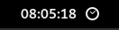

# Activity time

## Gnome shell extension for tracking your screen time. Needs [ActivityWatch](https://activitywatch.net/) to work.

### How does it works

- Make sure that your `ActivityWatch` service works properly. You can find more information in [documentation](https://docs.activitywatch.net/en/latest/getting-started.html).

- Extension gets data collected by [afk watcher](http://localhost:5600/#/timeline) today and sum duration of all `not-afk` events.

- You can configure watcher in `~/.config/activitywatch/aw-watcher-afk/` file.

